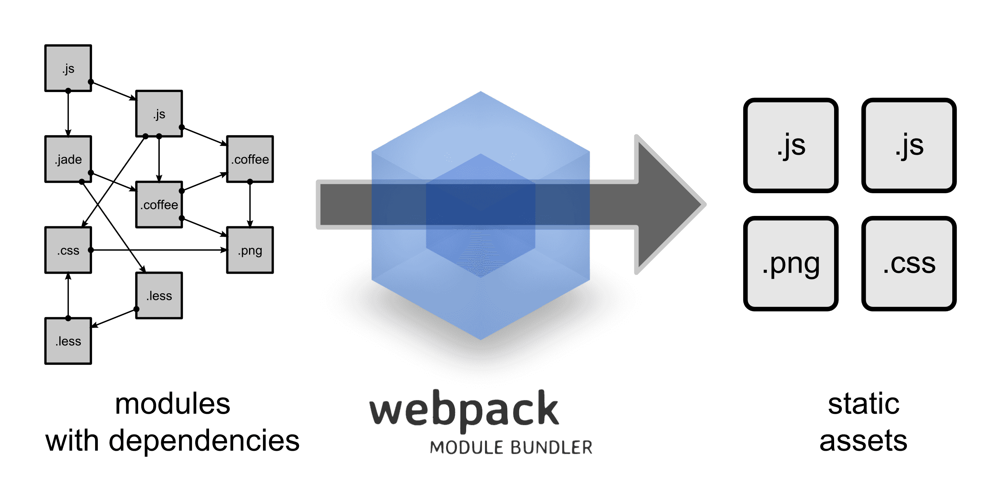

# 前言
+ 能做什么：将项目资源**打包**，生成**静态资源**；
+ 是什么：集前端自动化，**模块化**，组件化一体的一个系统，可以根据自己的需求进行配置，最后**打包**出你所需要的资源；
# 对比
## 传统项目
+ main.html
```
<html>
  <head>
    <title>没有工程化</title>
    <script src="http://apps.bdimg.com/libs/jquery/2.1.4/jquery.min.js"></script>
  </head>
  <body>
    <script src="app/main.js"></script>
  </body>
</html>
```
+ main.js

```
(function () {
  $('body').html('test');
})();
```
这样会带来什么问题呢？
+ 所有的变量都暴露在全局下，命名空间重复也会存在隐患;
+ jQuery必须加载成功之后，main.js中调用jQuery才不会报错
+ 如果以后使用的模块越来越多，这种隐式的依赖将会越来越多，导致请求数上升，<br>
并且中间漏掉一环，或者顺序错误，就有可能导致报错;
## 使用webpack工程化
+ <del>首先安装Nodejs</del>首先安装npm，再安装webpack,之后安装jquery；
+ 开始webpack，就可以这样写；
```
window.$ = require("jquery");
$('body').html('test');
```
# webpack
## webpack简单介绍

+ webpack的运行环境，首先是在**NodeJS**下，所以要首先安装**NodeJS**，**NPM**当然也会附赠给你，之后才有安装webpack；
+ webpack本身**不会分析代码**，她真心就是加载打包，完全看配置；
+ <del>当然gulp也可以，但webpack能做更多，也可以搭配gulp一起使用；</del>

## 如何启动webpack
安装好Nodejs之后，开始webpack启动的第一步；
+ 首先，在你的文件夹内启动命令行，npm init，生成一个**package.json**，这里可以定义一些信息，指令，依赖···
+ 其次，在这个json里面的**scripts**字段内，添加你需要的指令，<br>
+ 再次，启动这些指令，让webpack加载对应的配置文件开始编译；
+ 最后，这个Vue + Webpack里面查看我都配置了一些什么；

## 如何简单配置webapck
+ __filename，变量获取当前模块文件的带有完整绝对路径的文件名
+ __dirname，代表被执行的js所在的路径
+ process.cwd()，是当前执行node命令时候的文件夹地址 
+ 先照着这个config说一下
```
var path = require('path');
var webpack = require('webpack');
module.exports = {
  context: process.cwd(), // webpack编译的上下文环境
  watch: true, // 文件在变化之后，webpack动态编译
  entry: {
    main: './src/main' 
    // 这个是以前面的context为基准开始相对路径,一个key-value,
    // 里面的key就是后面你用['name'].js时,里面输出的name
  },
  deltool: 'source-map'
  // 资源映射表,debug能直接定位到源码出错的地方,免得看编译后文件
  output: {
    filename: '[name].js', 
    // entry里面"键"对应的"值",也就是流程文件,编译后叫"键".js;
    path: path.join(__dirname, './dist') 
    // 输出到哪里去,当然你在我这个项目结构下，写成这样也行
    // path: path.resolve(process.cwd(), './dist')  
  },
  // 核心区域,后面马上说,不在注释说
  module: {
    loaders: [
      { test: /\.vue$/, loader: 'vue' },
      { test: /\.js[x]?$/, loader: 'babel', exclude: /node_modules/ },
      { test: /\.css$/, loader: 'style!css!autoprefixer' },
      { test: /\.scss$/, loader: 'style!css!sass?sourceMap' },
      { test: /\.(html|tpl)$/, loader: 'html-loader' }
    ]
  },
  // 在解析时做的一些便利处理
  resolve: {
    // extensions做了在require时省略的扩展名
    // require('foo.css'); 可以写成require('foo');
    // require('bar.vue'); 可以写成require('bar');
    // require('qux.js'); 可以写成require('qux');
    // 不过本人而言，就算自己做了这一类配置,也会把后缀写出来,因为好维护
    extensions: ['', '.js', '.vue', '.css'],
    alias: {
      // alias 就是别名,做一个路径映射,少些一些路径
      // require('./src/views/bar.vue'); 就可以写成 require(views/bar);
      view: path.join(__dirname, './src/views'),
      components: path.join(__dirname, './src/components'),
      libs: path.join(__dirname, './src/libs'),
      utils: path.join(__dirname, './src/utils'),
    }
  },
  plugins: []
};
``` 
+ 模块有很多种,就需要针对不同的模块使用不同的加载策略,最后编译出浏览器能用的JS和CSS
  + 1.webpack只打包,不做代码检验,所以需要这些loader去加载,解析,编译
  + 2.loaders是一个数组,里面每一个对象都对应一种加载策略;
  + 3.test是正则检测拓展名,exclude是用来忽略,webpack选择用相应的loader去加载;
  + 4.里面的loader我用的是一个字符串写法,你觉得不习惯,下面两种写法都可以;
```
  // 数组写法
  {
    test: /\.css$/,
    loaders: ['style-loader', 'css-loader', 'autoprefixer']
  }
  // 字符串写法
  { 
    test: /\.css$/, 
    loader: 'style!css!autoprefixer' 
  }
```  
  + webpack会检测这里，如果是字符串就会以!为分割去找这些loader;
  + 还有,这些loader是Node按照package.json里面的devDependencies,
  然后递归去node_modules文件夹内寻找
  + 最后如果你遇到
  ```
  { 
    test: /\.js$/, 
    loader: "babel-loader", exclude: /node_modules/,
    query: {
      presets: ['es2015', 'stage-1']
    }
  }
  ```
  + 或者遇到
  ```
  { 
    test: /\.js$/, 
    exclude: /node_modules/,
    loader: "babel-loader?presets[]=es2015&presets[]=stage-3",
  }
  ```
  + **presets**是**babel**里面的,**plugins**只是集合而已
  例如说能够编译
  ```
  ()={} //箭头函数  
  let [...foo] = [1,2] //拓展运算符
  let foo = 1;
  const data = {"key": "value"};
```
+ 如果说还有一点，那就是plugins, 就是当你的模块打包之后，还需要额外的处理优化，
就可以在这里做，webpack也自带了很多插件，例如
```
module.exports = {
    ...
    plugins:[
        // 去除代码块内的告警语句
        new webpack.optimize.UglifyJsPlugin({
          compress: {
            warnings: false
          }
        }),
        // 优先考虑使用最多的模块，并为它们分配最小的ID
        new webpack.optimize.OccurenceOrderPlugin(),
        // 在打包后的文件前加注释信息
        new webpack.BannerPlugin('created by xxx')
    ]
    ...
}
```
+ 上述就是输出这个webpack的配置信息
  
## webapck大致结构